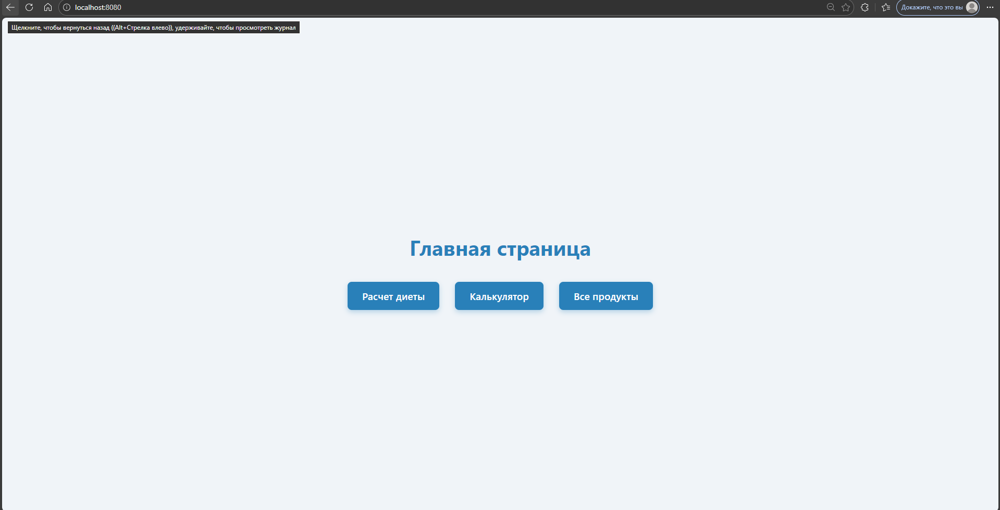
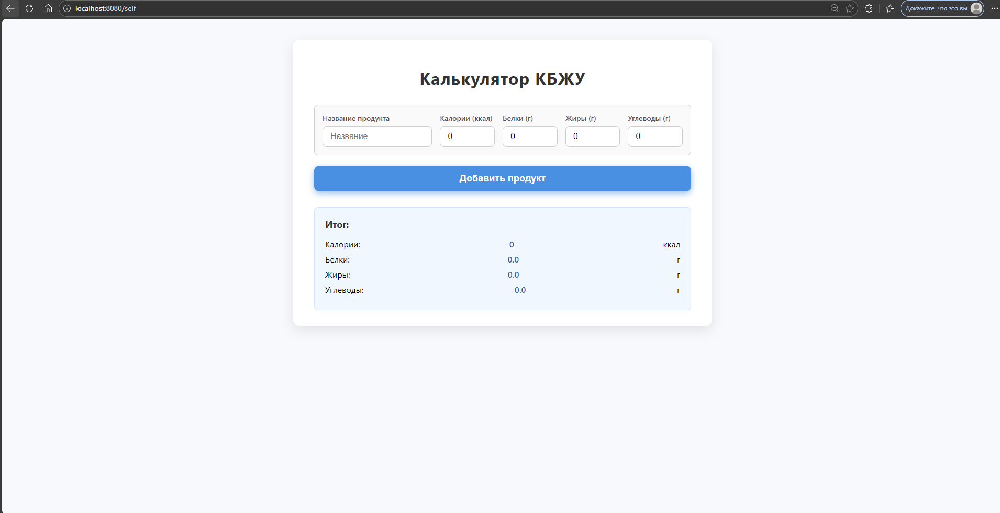
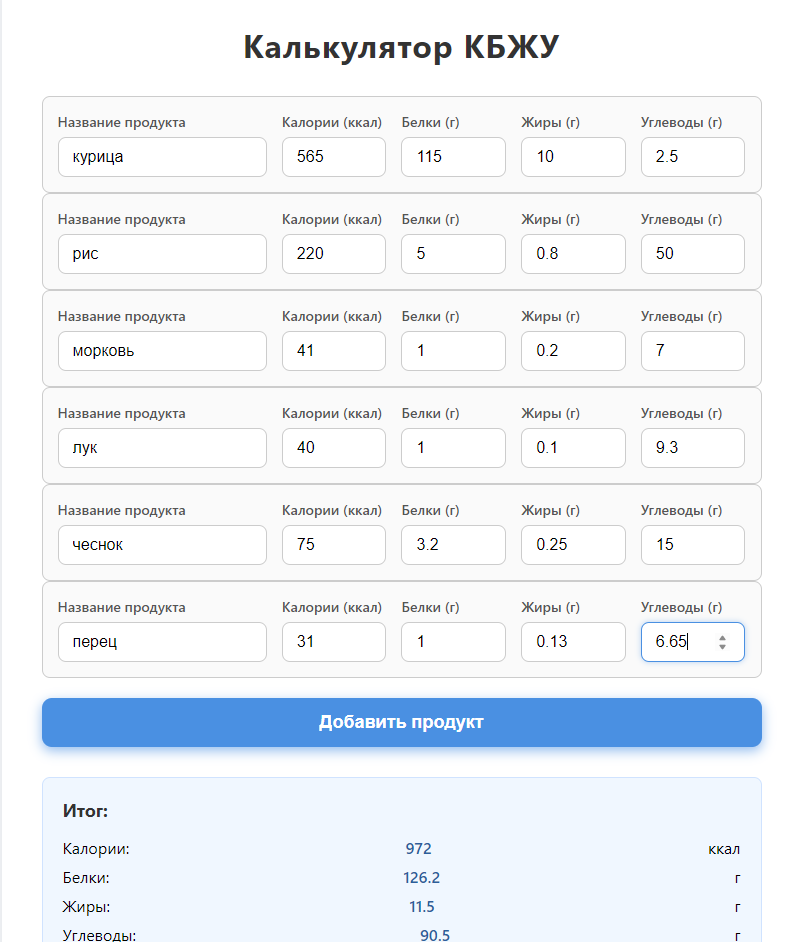
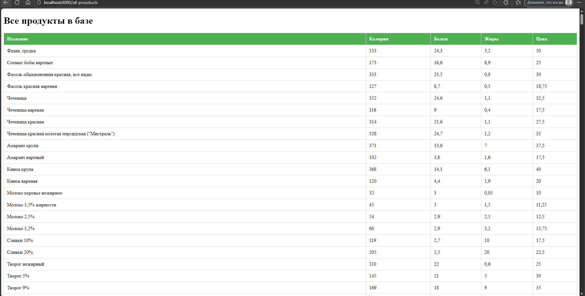
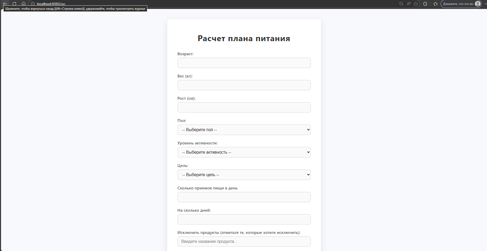
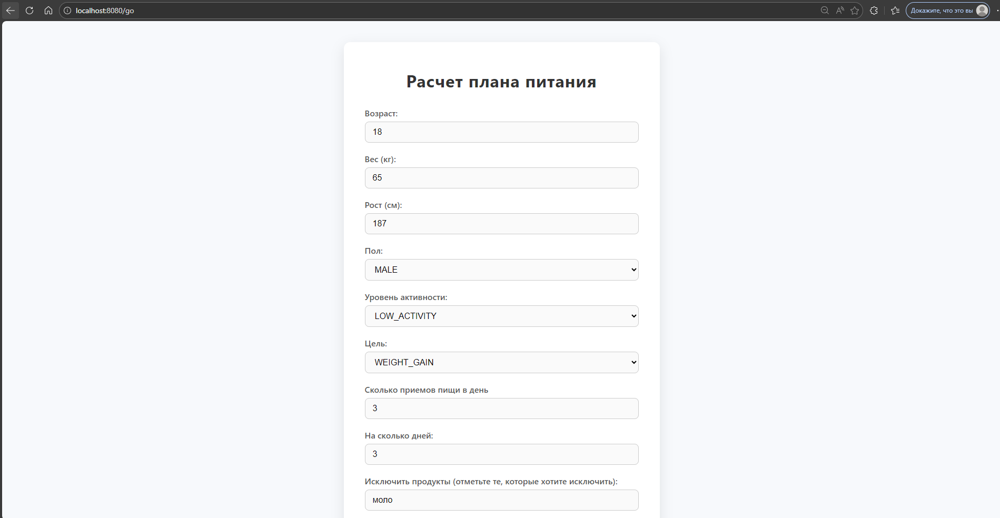
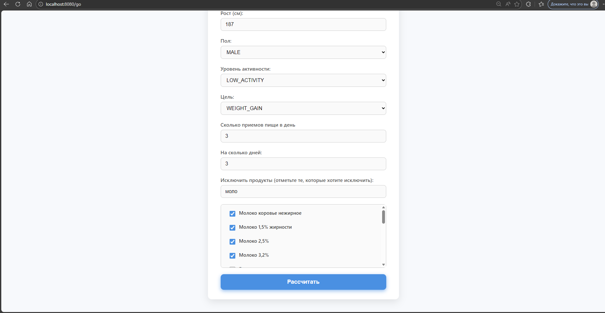
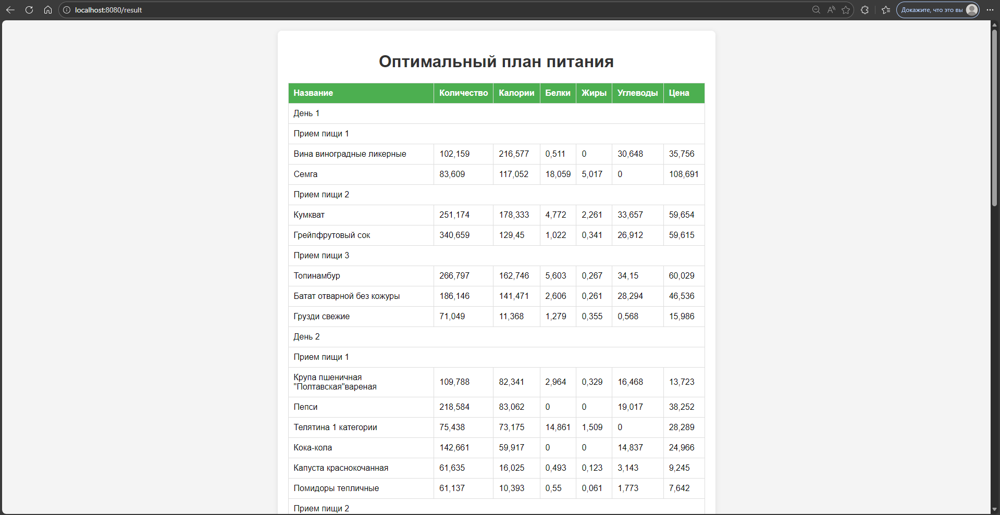
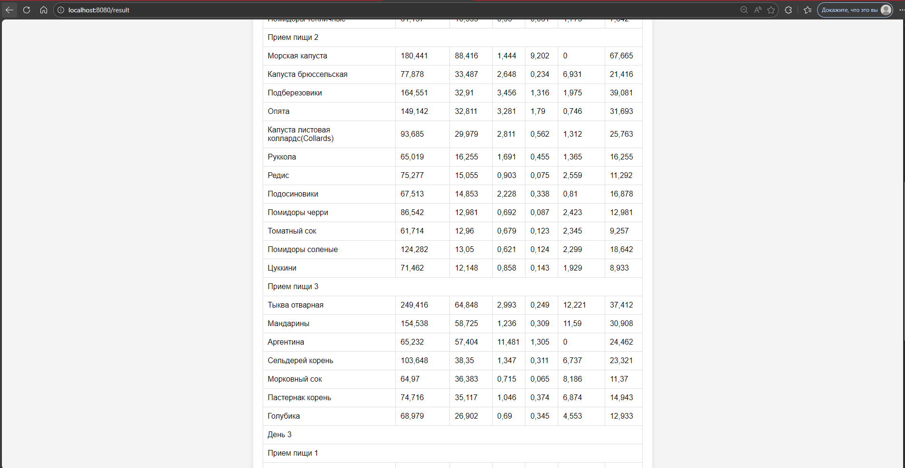
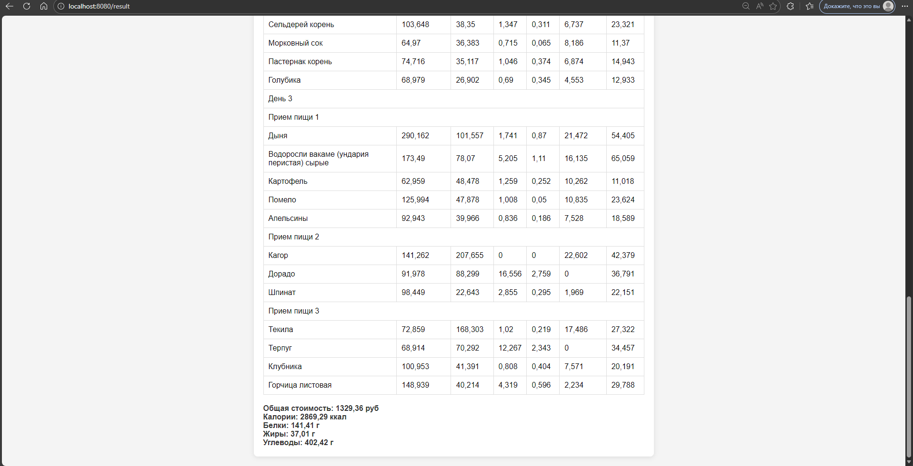

## MVC приложение для расчета диеты по входным параметрам, работающее на основе градиентного спуска и штрафов

### Скриншоты
#### Главная страница

#### Страница простого калькулятора 

#### Пример вычисления

#### Страница всех доступных продуктов из бд

#### Страница калькулятора диеты

#### Пример вычисления(входные данные)

#### Результат вычислений

### БД
#### Файл инициализации базы данных src/main/resources/static/init.sql